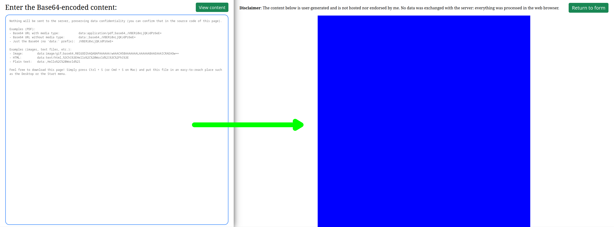

# Base64 Viewer

Simple page that allows you to view Base64-encoded files (PDF, PNG, JPG/JPEG, etc.) in the browser. Nothing is sent to the server, preserving data confidentiality.

## Features

- Multiple formats supported: PDF, PNG, JPG/JPEG, etc.
- Keyboard shortcuts:
    - `Ctrl + Enter`: renders the content of the Base64
    - `Escape`: returns to the form 
- Instant render from the URL
    - Simply open [tools.matiaspg.dev/base64-viewer](https://tools.matiaspg.dev/base64-viewer/?data=) passing your content in the `data` query param
    - Example: [Image of a blue square](https://tools.matiaspg.dev/base64-viewer/?data=data:image/gif;base64,R0lGODlhAQABAPAAAAAA/wAAACH5BAAAAAAALAAAAAABAAEAAAICRAEAOw==)
    - Pro-tip: add a shortcut in your browser so you can type in the search bar `base64 YOUR_BASE64_ENCODED_CONTENT`
- Data confidentiality: nothing is ever sent to a server

## TODO

- Allow selecting the file type if the text is not a data URL (for now it assumes it's a PDF)
- Add support for audio and video files
